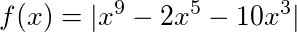

# 9. Standard library: miscellaneous

## 9.1. `string.h`

Execute the task using the functions from `<string.h>`.

Variants (click to open):

<details>
<summary>1</summary>
<hr>

Combine the two strings using the `strcat()` function and display the result:

```c
char destination[20] = "Bombarda ";
char source[] = "Maxima";
```

<hr>
</details>

<details>
<summary>2</summary>
<hr>

Create and compare two strings using the `strcmp()` function and show the message if they are equal.

<hr>
</details>

<details>
<summary>3</summary>
<hr>

Create a string, find the length of the string using the `strlen()` function, and display the result.

<hr>
</details>

<details>
<summary>4</summary>
<hr>

Combine the two strings using the `strcat()` function and display the result:

```c
char destination[20] = "Avada";
char source[] = " Kedavra";
```

<hr>
</details>

<details>
<summary>5</summary>
<hr>

Create and compare two strings using the `strcmp()` function and show the message if they are equal.

<hr>
</details>

<details>
<summary>6</summary>
<hr>

Create a string, find the length of the string using the `strlen()` function, and display the result.

<hr>
</details>

## 9.2. `math.h`

Create the `f(x)` function using the functions from `<math.h>`:

```c
double f(double x);
```

Demonstrate at least three examples of using it in the `f(x)` function.

| Variant | Math formula                |
| ------- | --------------------------- |
| 1       |  |
| 2       |  |
| 3       |  |
| 4       |  |
| 5       |  |
| 6       |  |

## 9.3. `ctype.h`

Read a character from the standard input. Using the functions from `<ctype.h>` check if the character  ...

| Variant | Description                     |
| ------- | ------------------------------- |
| 1       | ... is alphabetic.              |
| 2       | ... is decimal digit.           |
| 3       | ... is hexadecimal digit.       |
| 4       | ... is a punctuation character. |
| 5       | ... is lowercase letter.        |
| 6       | ... is uppercase letter.        |